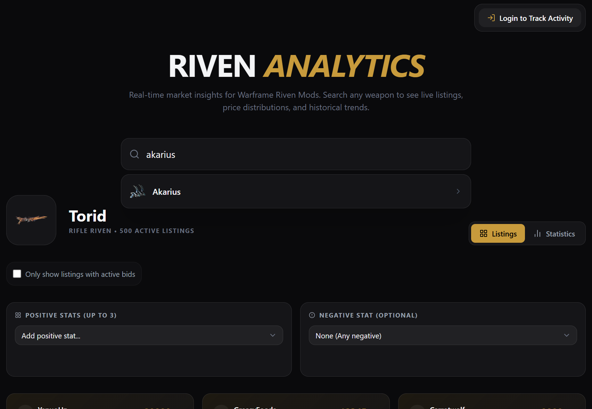

# Riven Analytics

A professional-grade market analysis tool for Warframe Riven Mods. Track live listings, analyze price distributions, and monitor community-driven historical trends.



## Features

- **Real-time Search**: Instant access to live Riven listings from Warframe.market, through accessing its API.
- **Price Analysis**: Visual price distribution charts to help you find the "sweet spot" for buying or selling.
- **Historical Activity**: Community-driven tracking of active bids and listing volume over time.
- **Advanced Filtering**: Filter by positive/negative attributes and bid status.
- **Contributor System**: Log in with Google to automatically contribute search data to the community's historical database.
- **Responsive Design**: Optimized for both desktop and mobile viewing with a sleek "Warframe-inspired" aesthetic.

## Tech Stack

- **Frontend**: React 18, Vite, TypeScript
- **Styling**: Tailwind CSS, Motion (Framer Motion)
- **Charts**: Recharts
- **Backend/Database**: Firebase (Firestore & Authentication)
- **Icons**: Lucide React

## Getting Started

### Prerequisites

- Node.js (v18 or higher)
- npm or yarn
- A Firebase project

### Installation

1. **Clone the repository**
   ```bash
   git clone https://github.com/your-username/riven-analytics.git
   cd riven-analytics
   ```

2. **Install dependencies**
   ```bash
   npm install
   ```

3. **Environment Setup**
   Copy the example environment file and fill in your Firebase configuration details:
   ```bash
   cp .env.example .env
   ```
   Open `.env` and add your Firebase credentials:
   ```env
   VITE_FIREBASE_API_KEY=your_api_key
   VITE_FIREBASE_AUTH_DOMAIN=your_project.firebaseapp.com
   VITE_FIREBASE_PROJECT_ID=your_project_id
   VITE_FIREBASE_STORAGE_BUCKET=your_project.firebasestorage.app
   VITE_FIREBASE_MESSAGING_SENDER_ID=your_sender_id
   VITE_FIREBASE_APP_ID=your_app_id
   VITE_FIREBASE_FIRESTORE_DATABASE_ID=(default)
   ```

4. **Run the development server**
   ```bash
   npm run dev
   ```

## Firebase Configuration

To enable the historical tracking and login features, you'll need to:

1. Create a project in the [Firebase Console](https://console.firebase.google.com/).
2. Enable **Google Authentication** in the Authentication section.
3. Create a **Firestore Database**.
4. (Optional) Deploy the security rules provided in the project to ensure data integrity.

## License

This project is licensed under the MIT License - see the [LICENSE](LICENSE) file for details.

## Acknowledgments

- Data provided by the [Warframe.market API](https://warframe.market/).
- Inspired by the incredible community and aesthetic of Digital Extremes' Warframe.
